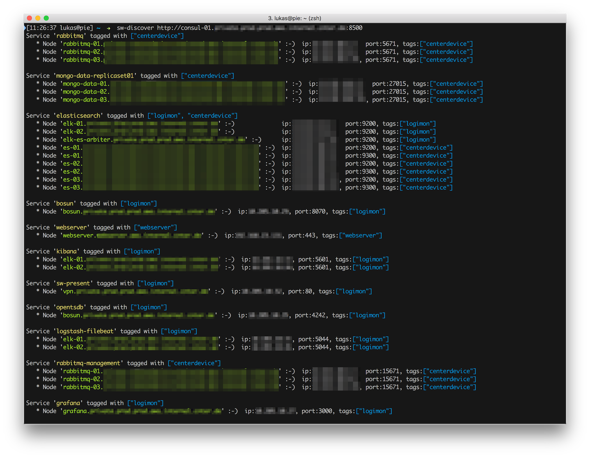
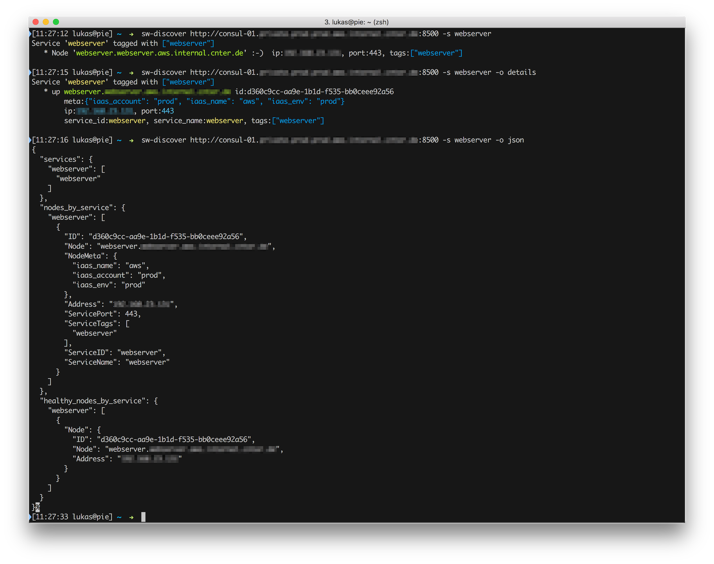
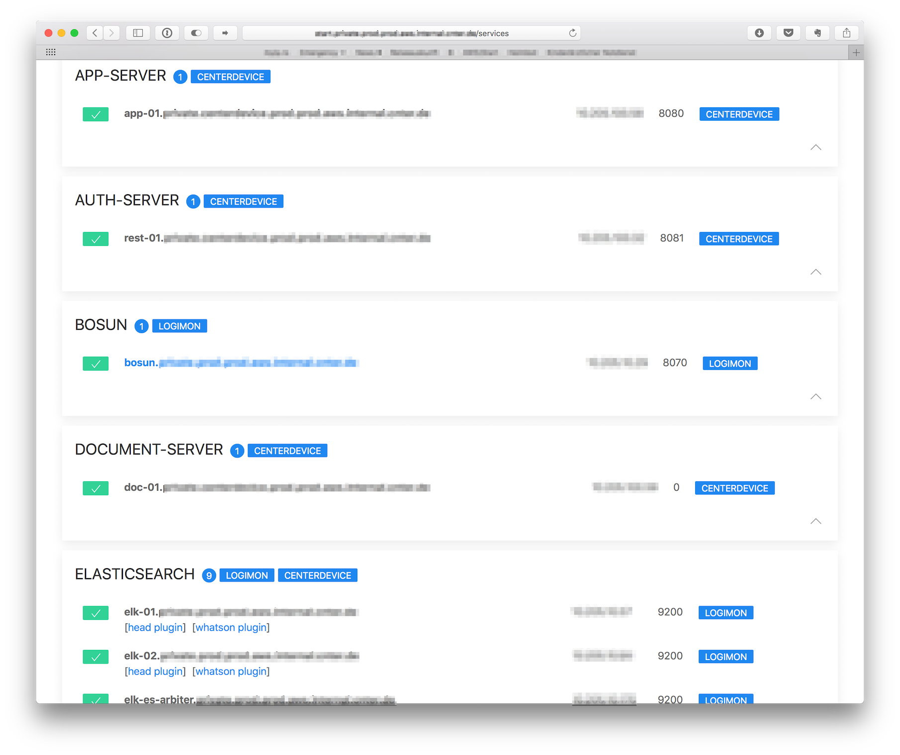
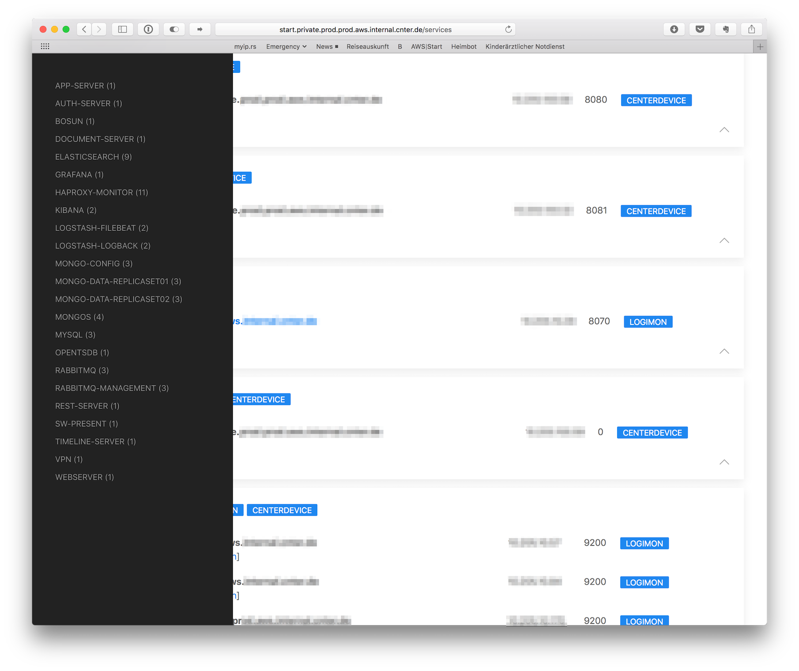

# Service World - Simply Discover Nodes and Services in Consul

[](https://travis-ci.org/lukaspustina/service-world) [](./LICENSE) [](https://cservice-worldes.io/cservice-worldes/service-world)

_service-world_ is a [Rust](http://rust-lang.org) and [Tokio](https://tokio.rs) based library to query [Hashicorp's Consul](https://consul.io) for nodes and services. The intention is to offer a command line tool as well as a simple webserver to discover the available nodes and services.  It contains two binaries [sw-discover](#sw-discover) and [sw-present](#sw-present). _sw-discover_ is a CLI client to display all services and nodes but also to filter by services and tags. Output can be either colored plain text or json for post-processing. _sw-present_ is intended to generate an HTML web page which can also be served using an internal web server. The HTML is generated using the [Handlebars](https://handlebarsjs.com) templating language provided through [handlebars-rust](https://github.com/sunng87/handlebars-rust).

<!-- START doctoc generated TOC please keep comment here to allow auto update -->
<!-- DON'T EDIT THIS SECTION, INSTEAD RE-RUN doctoc TO UPDATE -->
**Table of Contents**

- [Installation](#installation)
  - [Debian Package](#debian-package)
  - [Binaries](#binaries)
  - [Sources](#sources)
- [Usage](#usage)
  - [sw-discover](#sw-discover)
    - [Examples](#examples)
  - [sw-present](#sw-present)
    - [Configuration](#configuration)
    - [Examples](#examples-1)
- [Postcardware](#postcardware)

<!-- END doctoc generated TOC please keep comment here to allow auto update -->

## Installation

### Debian Package

Please add my [PackageCloud](https://packagecloud.io/lukaspustina/opensource) open source repository and install `service-world` via apt.

```bash
> curl -s https://packagecloud.io/install/repositories/lukaspustina/opensource/script.deb.sh | sudo bash
> sudo apt-get install service-world
```

### Binaries

You can find binary releases at [GitHub](https://github.com/lukaspustina/service-world/releases).

### Sources 

```bash
> rustup run nightly cargo install service_world --all-features
```


## Usage

### sw-discover

```plain
USAGE:
    sw-discover [OPTIONS] <url>

FLAGS:
    -h, --help       Prints help information
    -V, --version    Prints version information

OPTIONS:
    -o, --output <output module>       Selects output module [default: terminal]  [values: terminal, details, json]
    -s, --service <service name>...    Filters service for specified service names
    -t, --tag <tag name>...            Filters service for specified tags

ARGS:
    <url>    URL of consul agent to retrieve catalog from
```

#### Examples

* _sw-discover_ showing all services and nodes 

* _sw-discover_ filtering for service name, showing detailed as well as JSON output. 


### sw-present

```plain
USAGE:
    sw-present [FLAGS] --config <config> [url]

FLAGS:
    -h, --help       Prints help information
    -r, --rocket     Sets Rocket mode -- activates internal web server
    -V, --version    Prints version information

OPTIONS:
    -c, --config <config>    Sets config file

ARGS:
    <url>    URL of consul agent to retrieve catalog from
```

#### Configuration

There is a self-explanatory [example configuration](examples/sw-present.conf) file in the [examples](examples) subdirectory. A [minimalistic example configuration](distribution/deb/service-world/etc/sw-present/sw-present.conf) showing the mandatory configuration parameters is bundled in the [Debian Package distribution](distribution/deb) subdirectory. This subdirectory also includes [two examples](distribution/deb/service-world/var/lib/service-world/templates) for the necessary web page templates.

There are basically three sections. A general section describing where to find consul, a start page section specifying links for the start page, and a service section. The service section may specify link templates for each search that is used to generate links for each service in the service overview. In this way, you can enrich the service view with direct URLs for each service. For examples, HAProxy services can link to their monitor web page and Elastic Search services may link to their installed management plugins etc.

#### Examples

* _sw-present_ start page 

* _sw-present_ showing service catalog and service links 

* _sw-present_ showing service navigation 


## Postcardware

You're free to use _service-world_. If you find it useful, I would highly appreciate you sending me a postcard from your hometown mentioning how you use _service-world_. My work address is

```
Lukas Pustina
CenterDevice GmbH
Rheinwerkallee 3
53227 Bonn
Germany
```

